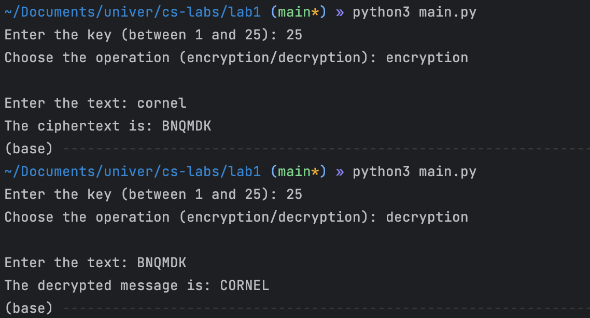
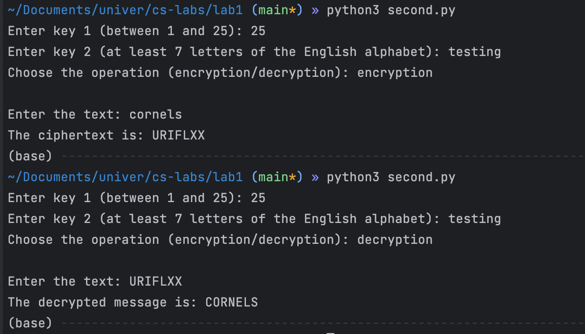

# Caesar Cipher Implementation

## Subject: Caesar Cipher

### Task 1

Implement the Caesar cipher for the English alphabet in a programming language of your choice.

1. Only use the letter encodings provided in the english alphabet (avoid using built-in encodings like ASCII or Unicode).

2. The key for the cipher should range between 1 and 25, inclusive. No other key values are permitted.

3. The input text should only contain letters between 'A' to 'Z' and 'a' to 'z'. No other characters are allowed.

4. If the user inputs invalid values, suggest the correct range of values to them.

5. Before encryption, convert the text to uppercase and remove all spaces.

6. Provide the user with options for either encrypting or decrypting text.

7. Allow the user to input the encryption key, as well as the message or cryptogram.

8. Output the encrypted cryptogram or the decrypted message based on the user's choices.

#### Implementation:

```python3
def caesar_cipher(text: str, key: int, action: str) -> any:
    result: str = ''

    alphabet: str = 'ABCDEFGHIJKLMNOPQRSTUVWXYZ'

    updated_text: str = text.upper().replace(" ", "")

    for char in updated_text:
        if 'A' <= char <= 'Z':
            if action == "encryption":
                encrypted_char = alphabet[(alphabet.index(char) + key) % 26]
                result += encrypted_char
            elif action == "decryption":
                decrypted_char = alphabet[(alphabet.index(char) - key) % 26]
                result += decrypted_char
        else:
            print("The text must contain only letters from 'A' to 'Z'.")
            return ""

    return result


if __name__ == "__main__":
    key: int = int(input("Enter the key (between 1 and 25): "))
    if key < 1 or key > 25:
        raise ValueError("The key must be between 1 and 25.")

    action: str = input("Choose the operation (encryption/decryption): ").lower()
    if action == "encryption" or action == "decryption":
        print()
    else:
        raise ValueError("Operation must be encryption or decryption")

    text: str = input("Enter the text: ")

    if action == "encryption":
        result: str = caesar_cipher(text, key, "encryption")
        print("The ciphertext is:", result)
    elif action == "decryption":
        result: str = caesar_cipher(text, key, "decryption")
        print("The decrypted message is:", result)
```

1. The function caesar_cipher takes three arguments: text (the text to be encrypted or decrypted), key (the Caesar cipher key), and action (either "encryption" or "decryption").

2. An empty string result and a string alphabet containing all uppercase English alphabet letters are initialized.

3. The function converts the input text to uppercase and removes spaces to create updated_text.

4. It then iterates through each character in updated_text.
    
      If the character is between 'A' and 'Z', it performs either encryption or decryption based on the action argument.

      If the character is not within this range, an error message is printed and an empty string is returned.

5. The main program asks for user input to provide a key (between 1 and 25), an action (either "encryption" or "decryption"), and the text to be processed.

6. Depending on the chosen action, the function caesar_cipher is called to produce either the encrypted or decrypted text.
#### Results:




### Task 2

1. Implement a dual-key Caesar cipher.
2. Follow the conditions specified in Task 1.
3. The second key must:

    Only contain letters from the Latin alphabet.

    Have a minimum length of 7 characters.

#### Implementation
```python3
def caesar_cipher_with_two_keys(text: str, key1: int, key2: str, action: str) -> any:
    result: str = ""

    alphabet: str = 'ABCDEFGHIJKLMNOPQRSTUVWXYZ'

    updated_text: str = text.upper().replace(" ", "")

    index_key2: int = 0

    for char in updated_text:
        if 'A' <= char <= 'Z':
            if action == "encryption":
                key = (key1 + ord(key2[index_key2 % len(key2)].upper()) - ord('A')) % 26

                encrypted_char = alphabet[(alphabet.index(char) + key) % 26]
                result += encrypted_char

                index_key2 += 1
            elif action == "decryption":
                key = (key1 + ord(key2[index_key2 % len(key2)].upper()) - ord('A')) % 26

                decrypted_char = alphabet[(alphabet.index(char) - key) % 26]
                result += decrypted_char

                index_key2 += 1
        else:
            raise ValueError("The text must contain only letters from 'A' to 'Z'.")

    return result


if __name__ == "__main__":
    key1: int = int(input("Enter key 1 (between 1 and 25): "))
    if key1 < 1 or key1 > 25:
        raise ValueError("Key 1 must be between 1 and 25.")

    key2: str = input("Enter key 2 (at least 7 letters of the English alphabet): ")
    if not (key2.isalpha() and len(key2) >= 7):
        raise ValueError(
            "Key 2 must contain only letters of the English alphabet and have a minimum length of 7 characters.")

    action: str = input("Choose the operation (encryption/decryption): ").lower()
    if action == "encryption" or action == "decryption":
        print()
    else:
        raise ValueError("Operation must be encryption or decryption")

    text: str = input("Enter the text: ")

    if action == "encryption":
        result: str = caesar_cipher_with_two_keys(text, key1, key2, "encryption")
        print("The ciphertext is:", result)
    elif action == "decryption":
        result: str = caesar_cipher_with_two_keys(text, key1, key2, "decryption")
        print("The decrypted message is:", result)
```

- In the dual-key version, a combined key is calculated using both `key1` and `key2` for each character to be encrypted or decrypted.
- The dual-key version uses an `index_key2` variable to track the position within `key2`, which affects the encryption and decryption logic.

#### Results:



## Conclusion
During this laboratory I've managed to implement two versions of Caeser Cipher Algorithm the first version being with a single key and the second with two. The Caeser cipher algorithm is a pretty straightforward encryption algorithm and easy to implement.
The second version of this algorithm I've implemented it also introduces a second key
which significantly improves the algorithm's complexity and increases greatly its security by simply introducing this said key, basically adding an extra layer of security. 
In conclusion I can say that by implementing an additional layer of security we can greatly improve the algorithm versatility and decrease its likely hood of being brute forced.
